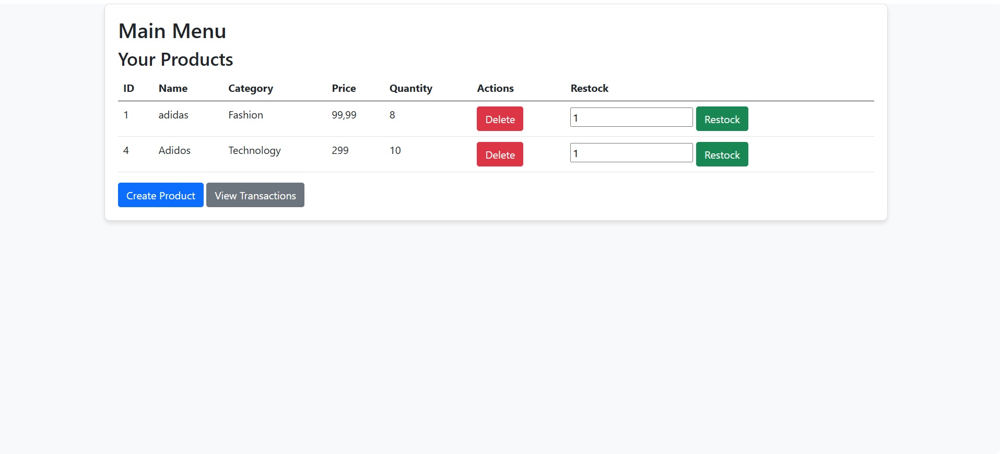

# README for the Microservices E-commerce System

## Thank You
First, I want to say thank you! This has been an exciting and fun challenge to work on, and I’m thrilled to share this prototype with you. Let’s dive in.

## The Big Picture
This project is a prototype for a simple e-commerce system designed with a focus on demonstrating SOLID principles and microservice architecture. It allows users to sign up as either a **Buyer** or a **Seller**, and here’s a high-level view of how the system works:

- **Buyers** can browse products, make purchases, and confirm their transactions.
- **Sellers** can create products, restock items, and view logs of sold products.
- Transactions remain in a "pending" state until buyers confirm their purchases.





## Project Focus
The primary focus of this project is to showcase my skills in:

1. **Adhering to SOLID Principles:** The codebase has been structured to ensure loose coupling, scalability, and ease of maintenance.
2. **Designing a Microservice Architecture:** Each service is independent and communicates through the DiscoveryService, a middleware that abstracts the actual service endpoints from the client.

While a monolithic architecture is simpler and more desirable, especially given the tight deadline, adopting microservices will provide greater benefits in the future.

## System Design


### Microservice Overview
The system consists of the following components:
1. UserService
- Manages user registration, authentication, and roles (Buyer or Seller).
- Generates and validates JWT tokens for secure communication.
2. ProductService
- Allows sellers to create, update, delete, and restock products.
- Buyers can view and search for products.
3. TransactionService
- Handles transactions, including creating transactions, updating their status, and fetching transaction histories for buyers and sellers.
4. DiscoveryService (Middleware)
- Acts as the single entry point for all client requests.
- Routes client requests to the appropriate service.
- Ensures that services remain agnostic of one another, maintaining loose coupling.

### Design Philosophy

This project embraces the complexity of a microservice architecture over the simplicity of a monolithic design to prioritize scalability and maintainability. Here’s why:

1. **Scalability:** Each service is independently deployable and scalable. This means we can scale high-traffic services (like ProductService) without affecting others.
2. **Loose Coupling:** By routing all communication through the DiscoveryService, no service depends directly on another. This aligns with the Dependency Inversion Principle.
3. **Extensibility:** New features can be added by introducing new services, without modifying or redeploying existing ones.
4. **Resilience:** If one service needs to be updated or replaced, the rest of the system can continue running seamlessly.

### Design Patterns
The project employs several well-known design patterns, each chosen to address specific challenges and align with SOLID principles. Here are the key patterns and why they were used:

### 1. **Repository Pattern**
   - **Where:** Found in `UserService` under the `UserRepository`.
   - **Why:** This pattern provides a clean abstraction for database access. It separates the data access logic from the business logic, ensuring that the system adheres to the **Single Responsibility Principle**. This makes the code easier to test and maintain.

### 2. **Factory Pattern**
   - **Where:** Used in `UserService` via the `UserFactory`.
   - **Why:** The factory ensures consistent and valid creation of `User` entities. By centralizing the creation logic, we ensure that business rules are applied uniformly whenever a `User` object is instantiated.

### 3. **Dependency Injection**
   - **Where:** Throughout the system, managed by the `ServiceCollection` extensions in `UserService`, `DiscoveryService`, and other services.
   - **Why:** This pattern allows for loose coupling between components. Dependencies like repositories, services, and clients are injected where needed, adhering to the **Dependency Inversion Principle**. This makes testing and swapping implementations seamless.

### 4. **Middleware Pattern**
   - **Where:** DiscoveryService acts as middleware for all client and service communication.
   - **Why:** By centralizing routing and abstracting communication, this pattern enforces **Open/Closed Principle**—services remain independent and open for extension without modifying core logic. It also simplifies client-side interactions by exposing a single entry point.

### 5. **Builder Pattern (Token Management)**
   - **Where:** In `AuthService` within `UserService` for constructing JWT tokens.
   - **Why:** This pattern is used to construct complex JWT tokens with multiple claims while maintaining clarity and flexibility. It aligns with the **Builder Pattern** by separating the construction of the token from its representation.

### 6. **Adapter Pattern**
   - **Where:** Found in `DiscoveryService` service clients, like `UserServiceClient`, `ProductServiceClient`, and `TransactionServiceClient`.
   - **Why:** These adapters translate internal system requests into HTTP requests that the downstream services understand. This ensures that DiscoveryService can act as an agnostic middleware while providing a consistent interface to the client.

### 7. **Strategy Pattern**
   - **Where:** In `PasswordHasher` for hashing and verifying user passwords.
   - **Why:** By using a pluggable hashing algorithm, the system is open to swapping out or upgrading password hashing techniques without modifying the client code.

### Why These Patterns Were Chosen
The primary objective was to create a **scalable**, **loosely coupled**, and **maintainable** system. These patterns collectively enable:
- Clear separation of concerns, making the system easier to understand and extend.
- High testability through abstraction and interface-driven design.
- The ability to evolve individual components independently without affecting the overall system.

For example, the **Adapter Pattern** used in DiscoveryService allows each microservice to function independently, with DiscoveryService managing communication. Similarly, the **Repository Pattern** ensures database interactions are encapsulated, making database changes straightforward.

### Current Implementation

Due to tight deadlines, service communication currently uses traditional HTTP requests via the DiscoveryService. However, for real-world applications:
- **Message Brokers** (e.g., RabbitMQ, Kafka) would improve performance and enable asynchronous communication.
- **Redis** or similar caching solutions are highly recommended to ensure fault tolerance. For example, if a service is down, data can be retrieved from the cache instead of making repeated calls to the downed service.

## How to Run the Project

This project is designed to be easy to run using **Docker**. As long as you have Docker installed, you can set up and launch the entire system with just a few commands.

### Prerequisites
- Docker and Docker Compose installed on your machine.
- A terminal or command line interface.

### Steps to Run the Project

1. Navigate to the root folder of the project.
2. Build the Docker images with the following command:
   ```bash
   docker-compose --profile production build
3. Once the build is complete, start the services:
   ```bash
   docker-compose --profile production up
4. The system should now be running. You can access the services via the respective endpoints (e.g., http://localhost:<port>).

